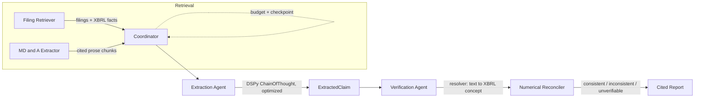

# The Disclosure Verifier

[](https://github.com/asim-aa/disclosure-verifier/actions/workflows/ci.yml)

**An agentic system that checks whether a company's own words match its own numbers.**

Public companies make thousands of quantitative claims a year in MD&A prose — *"revenue increased 27% to $214.4 billion."* SEC EDGAR also publishes the exact structured data (XBRL) those claims should be derived from. Almost nobody actually cross-checks the two. This project retrieves both, extracts discrete claims from the prose with an optimized LLM pipeline, and reconciles each one against the real reported numbers — with a citation back to the exact filing.

```
"Revenue for fiscal year 2026 was $215.9 billion, up 65% from a year ago."
   -> extracted:  {metric: Revenue, value: 215_900_000_000, type: absolute}
                  {metric: Revenue, value: 65.0, type: growth_pct}
   -> reconciled:  consistent   (EDGAR: $215,938,000,000 — 0.02% off)
                   inconsistent (EDGAR implies 46.09% growth, not 65%)
```

Built as the capstone for the SupportVectors AI Agents Bootcamp, against four required pillars: real MCP tools, a DSPy-optimized prompt with a measured baseline delta, a justified multi-agent architecture, and RLVR/GRPO fine-tuning with a noise-floor-checked before/after result.

📄 **[Read the full case study (PDF)](docs/case-study.pdf)** — results, a live example, and the real bugs found along the way.

---

## Architecture



Three independent tools (Pillar 1) wired into a hierarchical pipeline (Pillar 3), not a single autonomous loop — deliberately. The *sequence* here never needs an LLM's judgment (you always retrieve before extracting, always extract before verifying); what needs deciding is narrower — skip a chunk with no claims, flag a claim that can't be resolved — and that's ordinary code, not a reasoning task. The one stage that genuinely needs the model (claim extraction) is the one DSPy-optimized signature in the system, run as `dspy.ChainOfThought` so the model reasons through which spans are checkable claims before committing to structured output.

| Layer | What it does | Real / Mock |
|---|---|---|
| **Filing Retriever** | Pulls 10-K/10-Q filings + XBRL facts from EDGAR | [`tools/filing_retriever.py`](tools/filing_retriever.py) |
| **MD&A Extractor** | Extracts prose paragraphs from filing HTML, cited to accession number | [`tools/mdna_extractor.py`](tools/mdna_extractor.py) |
| **Numerical Reconciler** | Checks a structured claim against XBRL facts (4 comparison types) | [`tools/reconciler.py`](tools/reconciler.py) |
| **Extraction Agent** | DSPy-optimized signature — prose → structured claims | [`eval/dspy_extractor.py`](eval/dspy_extractor.py) |
| **Verification Agent** | Resolves free-text claims to exact XBRL concepts, then reconciles | [`agents/verification_agent.py`](agents/verification_agent.py) |
| **Coordinator** | Routes the pipeline; enforces a budget; checkpoints for resume | [`agents/coordinator.py`](agents/coordinator.py) |
| **RLVR/GRPO fine-tuning** | Trains reconciliation-reasoning via the Reconciler-derived reward | [`phase7/train_grpo.py`](phase7/train_grpo.py) |

## Results

**Pillar 2 — DSPy prompt optimization**, measured on a held-out test set (hand-labeled *before* any DSPy code was written, to keep the ground truth honest):

| | Precision | Recall | F1 |
|---|---|---|---|
| Hand-written baseline prompt | 0.711 | 0.750 | 0.730 |
| DSPy zero-shot (`ChainOfThought`, no demos) | 0.763 | 0.806 | 0.784 |
| **DSPy optimized** (BootstrapFewShot, 4 demos) | **0.763** | **0.806** | **0.784** |

Switching the DSPy signature from `Predict` to `ChainOfThought` — reasoning before committing to structured output — took zero-shot DSPy from *underperforming* the hand-written baseline (0.676 F1) to clearly *beating* it (0.784 F1) before any optimization ran. `BootstrapFewShot` on top of that produced **exactly identical numbers** — verified this wasn't an evaluation bug (the compiled program is a genuinely separate instance, and the optimizer log confirms 4 real demonstrations were bootstrapped). Reasoning captured essentially all the available signal; the few-shot demos added nothing further.

**But the pooled F1 delta doesn't survive closer scrutiny, and that's worth reporting rather than smoothing over.** Two checks that changed the honest headline:

1. **Noise floor.** At n=45 claim-level decisions (the actual sample size the precision/recall proportions are computed over — not just the 16 test paragraphs), the 95% noise floor is **±0.120 F1**. The measured +0.054 delta over baseline is *inside* that noise floor — not statistically distinguishable from chance at this sample size. `eval/run_comparison.py` computes and prints this check on every run rather than reporting a bare delta.
2. **Stratified breakdown by `comparison_type` exposes a masked regression.** The pooled number hides a real split:

   | comparison_type | baseline F1 | optimized F1 |
   |---|---|---|
   | `growth_pct` | 1.000 | 1.000 |
   | `absolute` | 0.625 | 0.788 |
   | `absolute_change` | 0.429 | **0.308** (worse) |

   `growth_pct` is trivially easy for this task and perfect in every condition, propping up the pooled score. `absolute` genuinely improved with optimization. `absolute_change` got *worse* — a real regression that a pooled average completely hides, because it happened at the same time `absolute` improved and the two roughly canceled out. This is precisely the "aggregate smiles while a stratum bleeds" failure mode: reporting only the pooled F1 would have missed it entirely.

The honest conclusion: reasoning (`ChainOfThought`) is a real, large improvement over a bare `Predict` call. Whether `BootstrapFewShot` optimization helped, hurt, or did nothing net is **not resolved by this test set** — it's too small to tell, and what data exists suggests it may have *traded* accuracy from one claim type for another rather than improving overall. Ground truth: 78 hand-labeled examples / 161 claims / 9 true negatives, drawn from real MSFT and NVDA filings.

*A further caveat worth naming explicitly:* `eval/dataset.py`'s split (train ~80% / test ~20%, by index) is a clean single-touch holdout in structure, but not in practice at this point — the same 20% test slice has now been scored and reported on repeatedly during this project's own development (baseline, zero-shot, optimized, the stratified breakdown, the noise-floor check above). By the discipline this project otherwise holds itself to, that means the reported numbers above are better read as "the best available honest estimate from a set we've looked at many times" than as a single clean holdout evaluation. A genuinely fresh, never-touched test slice is what it would take to fully re-close this — flagged as a real gap, not silently assumed away.

Separately: `eval/run_comparison.py`'s original DSPy optimization metric (`dspy_metric`, still what `BootstrapFewShot` uses) returns a bare F1 float, no diagnostic feedback text. That matters for one specific decision — `dspy.GEPA` (a reflective optimizer, a candidate next step above `BootstrapFewShot`) only out-performs simpler optimizers when its metric can describe *why* an attempt failed; against a purely scalar pass/fail-shaped metric, GEPA's reflective-mutation step has nothing to read and its usual edge doesn't apply. The prerequisite is now built rather than left as a gap: `dspy_metric_with_feedback` (backed by `eval/metrics.py`'s `feedback_for_example`) returns the same score plus a diagnostic string naming exactly which claims were missed or extraneous, and accepts GEPA's calling convention directly. Trying GEPA is now a metric swap away, not a metric redesign, and it has since actually been run — see [`eval/run_gepa.py`](eval/run_gepa.py). Honest caveat stated up front there, not discovered after the fact: GEPA's reflective step is meant to be guided by a model *stronger* than the one being optimized, and this project has exactly one LLM endpoint (gpt-oss-20b) — it reflects on its own failures here, not a stronger model's read on them, a real limitation on what this run can show. Result: `auto="light"` (444 metric calls, ~37 min on the local single-GPU server) moved F1 from 0.784 (zero-shot) to **0.800** — a +0.016 delta that's *inside* the ±0.117 noise floor at this test set size, so not distinguishable from chance, same honest conclusion as the `BootstrapFewShot` result above. The per-category breakdown is more interesting than the pooled number: GEPA's rewritten instruction reached a perfect 1.000 F1 on `growth_pct` and improved `absolute` to 0.857, but `absolute_change` collapsed to 0.167 — a real trade-off, not a clean win, echoing the same "may have traded accuracy between claim types rather than improving overall" pattern already seen with `BootstrapFewShot`. Run again with a stronger reflection model or a larger `auto` budget and this could look different; reported as what actually happened with the one endpoint available, not what a better-resourced run might show.

**Pillar 4 pre-flight — the Reconciler's own correctness, isolated from extraction.** Before the Reconciler is ever trusted as an RLVR reward, `eval/reconciler_audit.py` runs it against a battery of known-good, known-bad, and adversarial cases (sign flips, order-of-magnitude confusion, mislabeled comparison types, exact tolerance-boundary probes) — 15/15 matched the hand-computed expected verdict, and critically, **zero false-"consistent" results**, the dangerous failure mode for a reward signal (a false "inconsistent" just costs training signal; a false "consistent" actively teaches a policy that a wrong answer was right). Enforced permanently in CI via `tests/test_reconciler_audit.py`. Every verdict also carries a machine-readable `reason_code` (`near_miss`, `missing_fact`, `zero_denominator`, ...) instead of only free-text explanation — usable both as reward-shaping material for Phase 7 and as structured error-analysis output today.

The audit also lets us apply the maker/checker precision-ceiling formula — `Pr(correct | accepted) = pr / (pr + (1-p)f)`, where `p` is extraction precision, `r` is verifier recall, and `f` is verifier false-positive rate — to state what actually bounds end-to-end system accuracy. From the audit's cases: `r = 1.000` (6/6), `f = 0.000` (0/8, ~0.375 95% upper bound by the rule of three at this sample size). With the DSPy-optimized extraction precision (`p = 0.763`), the formula gives a ceiling of **1.000** — a f=0 verifier means every claim it accepts as "consistent" is trustworthy regardless of upstream extraction precision, on this test surface. The small n keeps this illustrative rather than statistically tight, same caveat as the noise-floor finding above.

Reward-shaping design for Phase 7 was recorded in [`docs/phase7-reward-design.md`](docs/phase7-reward-design.md) before any GPU time was spent on it — full results below.

**Pillar 4 — RLVR/GRPO fine-tuning**, measured the same way as Pillar 2: baseline vs. trained, checked against the noise floor, not just reported as a raw delta. `Qwen2.5-7B-Instruct` (QLoRA, LoRA rank 32, via Unsloth) trained on a single RTX 4090, using the shaped Reconciler-derived reward to learn reconciliation-*reasoning* — given already-resolved claim values, reason to a verdict, rather than calling `reconcile()` directly:

| | baseline (zero-shot) | trained (1 epoch, 1,300 GRPO steps) |
|---|---|---|
| accuracy | 0.766 | **0.855** |
| mean reward | 0.633 | **0.826** |
| false-consistent rate (dangerous case) | 0.148 | **0.036** |
| format failures | 1/304 | **0/304** |

At n=304, the accuracy delta (+0.089) clears its 95% noise floor (±0.062) and the false-consistent-rate drop (−0.112) clears its own (±0.045) — both are real, not sampling noise. The `absolute_change` claim category shows the largest, also noise-floor-clearing gain (0.589→0.821). `bps_change` — the hardest category (two ratios, then a basis-point difference) — moved (0.233→0.400) but not provably at its small n=30. Full breakdown, a worked before/after example, and the three real upstream packaging bugs found getting here: [`docs/phase7-results.md`](docs/phase7-results.md).

**A real, current end-to-end run** (NVDA's FY2026 10-K, live EDGAR + live LLM, no cached answers):

```
consistent     Revenue                             $215,900,000,000   (EDGAR: $215,938,000,000 — 0.02% off)
inconsistent   Revenue growth                       65.0%             (EDGAR implies 46.09%)
consistent     Income tax expense                  $21,400,000,000    (EDGAR: $21,383,000,000 — 0.08% off)
inconsistent   Income tax expense (FY2025 figure)  $11,100,000,000    (compared against wrong period — known limitation, see below)
unverifiable   Data Center revenue                  68.0% growth      (segment-level, no top-level XBRL tag — correctly declined, not guessed)
```

**Engineering rigor:** 176 automated tests (unit + live-network + live-LLM tiers), green on every push via GitHub Actions.

## What actually broke, and how it got caught

The interesting engineering in this project wasn't writing the happy path — it was what real SEC data did to the happy path. A few examples, each caught by testing against *live* data rather than trusting the design on paper:

- **A dangerous string-matching shortcut.** Metric resolution originally tolerated wording variance via substring matching — but `"revenue"` is a substring of `"Azure and other cloud services revenue"`, so it would have silently verified a *segment's* revenue against *total company* revenue and produced a confidently wrong "consistent" verdict. Fixed to exact-match-plus-explicit-aliases only. [`agents/resolver.py`](agents/resolver.py)

- **XBRL doesn't tag percentages as `percent`.** Rate concepts like effective tax rate are reported as `unit="pure"` — a decimal fraction (`0.19`, not `19`). A claim stating "19%" would have either never matched the fact at all, or (once that was fixed) been compared as `19.0` against `0.19` and read as wildly inconsistent even when correct. [`agents/verification_agent.py`](agents/verification_agent.py)

- **Companies retag their own XBRL concepts over time.** NVDA reported revenue under `RevenueFromContractWithCustomerExcludingAssessedTax` through FY2022, then switched to plain `Revenues` — the old tag never disappears from the company's concept list, it just stops getting new data. Picking "first candidate that exists at all" silently locked onto a tag with no data newer than 2022. Fixed to pick by data recency.

- **A later filing can corrupt an earlier one's claims.** A claim extracted from a 10-K's MD&A describes *that 10-K's* fiscal year — but if a newer 10-Q has since been filed (nearly always true), its more recent quarterly `period_end` would otherwise get picked as "current," comparing the wrong two numbers entirely. Fixed with an `as_of` cutoff anchoring resolution to the claim's own source filing.

- **A metric-matching bug caught by its own unit test before it ever ran on real data**: an early precision/recall scorer would have counted generic `"Revenue"` as matching segment-specific `"Microsoft Cloud revenue"` — a bug in the *measurement*, which is worse than a bug in the thing being measured, since it makes bad results look good. Caught and fixed before the real comparison ran.

- **Chain-of-thought reasoning silently corrupted its own numeric output.** Switching to `dspy.ChainOfThought` made the model write dollar amounts in shorthand inside its `reasoning` field — *"$215.9 billion"* — and then just echo that literal `215.9` into the structured `value` field instead of expanding it to `215900000000`, consistently, every run. Plain `Predict` never had this failure mode because it never generates that intervening shorthand text to anchor on. Fixed by instructing the signature to write the fully-expanded number in the reasoning itself, so the structured step has nothing left to get wrong. [`eval/dspy_extractor.py`](eval/dspy_extractor.py)

- **A claim could be marked wrong for being correct — at the time it was made.** SEC filings restate: a later 10-K/A amendment can revise an XBRL figure after the original filing. Without tracking *when* a fact was filed relative to the claim's own source filing, the reconciler's restatement-handling logic (correctly preferring the most recent value when duplicates disagree) could compare an old, accurate claim against a *later* restatement and call it "inconsistent" — the claim was right when it was written, and the world's record of that period simply changed afterward. Fixed by threading the claim's own filing date (`as_of`) into the reconciler's fact-matching itself, not just its period-selection layer (which Phase 5 already handled). [`tools/reconciler.py`](tools/reconciler.py)

- **The same bitemporal bug, found a second time via a tool-contract audit.** Reading `tools/numerical_reconciler.py`'s MCP tool docstring as if deciding how to call it (the "read it like the calling model would" discipline) surfaced that `reconcile_claim` — the literal Pillar 1 tool, callable independently of the Coordinator — never exposed an `as_of` parameter at all, so a direct caller had no bitemporal protection even after the agent-path fix above landed. Fixed by adding `as_of` to the tool's signature and threading it into `reconcile()`. [`tools/numerical_reconciler.py`](tools/numerical_reconciler.py)

One limitation is still open and documented rather than hidden: the verification agent can distinguish "the source filing's own period" from "the next most recent one," but doesn't yet parse a claim's *stated* period text (e.g. distinguishing a paragraph's FY2026 figure from its FY2025 comparison in the same sentence) — so a claim about an explicitly non-current period can still resolve against the wrong one. Flagged in [`agents/resolver.py`](agents/resolver.py) as follow-up, not silently left broken. A fuller accounting of what's explicitly in and out of scope — maker/checker independence, idempotency, why doom-loop detection doesn't apply here — is in [`docs/robustness-and-scope.md`](docs/robustness-and-scope.md).

## Harness: budget and checkpointing

A real 10-K MD&A can run 100+ paragraphs, each needing its own LLM call. The coordinator enforces a `Budget` (max chunks / max LLM calls / max wall-clock seconds) and checkpoints progress after every chunk — a crash or an intentional stop loses at most the one chunk in flight, not the whole run. Verified against the live pipeline: a budget-interrupted run picks up exactly where it left off on the next call, without re-processing anything already done. [`agents/checkpoint.py`](agents/checkpoint.py)

## Structure

```
tools/    MCP servers — Filing Retriever, MD&A Extractor, Numerical Reconciler (Pillar 1)
eval/     DSPy signature, hand-labeled test set, baseline-vs-optimized harness (Pillar 2)
agents/   Coordinator + retrieval/extraction/verification agents, budget, checkpointing (Pillar 3)
phase6/   End-to-end integration-at-scale run (real Coordinator, 5 companies, no mocks)
phase7/   RLVR/GRPO fine-tuning — dataset builder, reward, training/eval scripts (Pillar 4, GPU-only)
docs/     Design docs — reward design, results, robustness & scope
data/     Local cache / checkpoints (gitignored)
tests/    168 tests — unit (always run) + 8 live-network/live-LLM (opt-in via -m)
```

## Setup

```bash
python -m venv .venv
source .venv/bin/activate
pip install -e ".[dev]"
cp .env.example .env  # then fill in EDGAR_USER_AGENT and LLM_* config
```

## Test

```bash
pytest -v                 # 181 unit tests, no network/LLM required
pytest -v -m network       # + live SEC EDGAR checks
pytest -v -m llm           # + live LLM checks (requires LLM_BASE_URL reachable)
```

## Status

**All phases (0–7) complete.** Phase 6 (end-to-end integration at scale — the real Coordinator, no mocks, run against 5 companies including 2 never used during development) surfaced two honest, well-diagnosed coverage gaps rather than a clean pass. Both are now addressed, each to the extent it honestly could be: MD&A heading detection didn't generalize past the 3 companies it was built against, root-caused and fixed in `tools/mdna_parser.py` (all 5 companies now retrieve real MD&A text). The resolver's 14-concept scope turned out to be two different problems: part was just missing dictionary entries for real, standard concepts (18 more added and verified against live AAPL/MSFT/NVDA data — MSFT's "remaining performance obligation" claims now resolve to real consistent/inconsistent verdicts instead of "unverifiable"), and part is a genuine data-source limit confirmed by inspecting the raw SEC data directly: segment/product figures (Azure, LinkedIn, XBOX revenue) have no dimensional breakdown anywhere in the company-facts API this pipeline reads, so those correctly stay unresolved rather than guessed. Zero crashes across the batch throughout; the harness held up, the coverage claims are now precisely bounded rather than vague, and that distinction is the actual finding. The harness's other claim — checkpoint/resume — was also exercised against a real filing (not just mock scenarios): a real budget stop mid-document, a real on-disk checkpoint, a real resume that skipped the already-processed chunks and continued forward — see [`docs/phase6-results.md`](docs/phase6-results.md).
